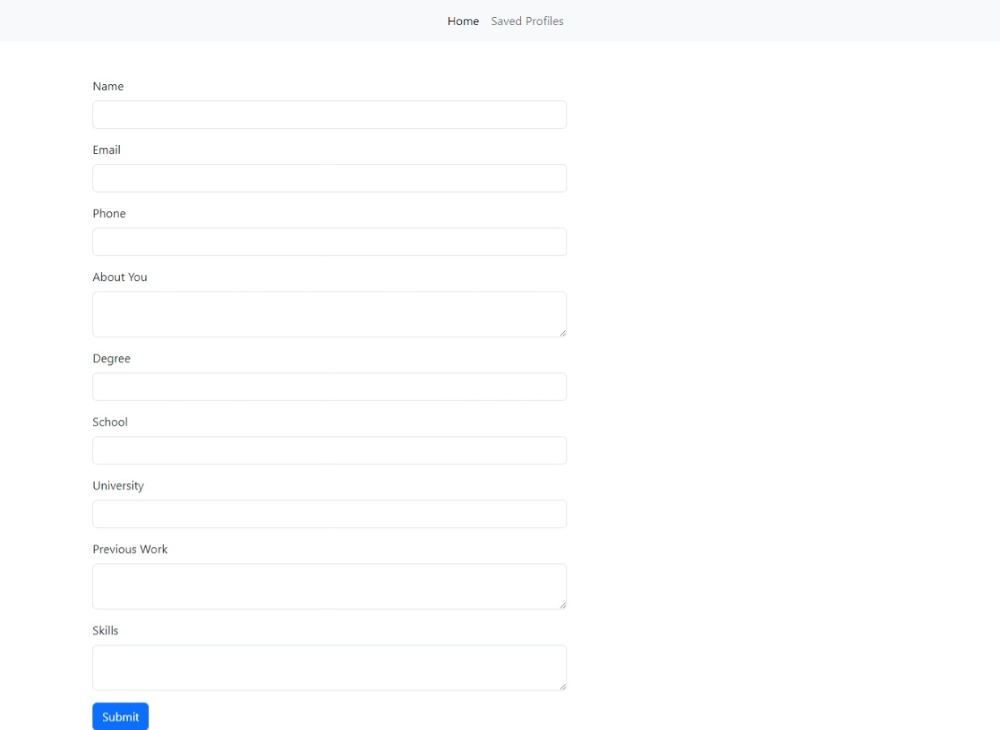

# UdemyProjects
9 projects from the "Django Masterclass" course

In order of appearance:
1. Web Based CV Generator opens a form that the user fills with data and returns (directly downloads) a pdf file with the result
   - it needs wkhtmltopdf on your device in order the conversion to work
   (https://github.com/wkhtmltopdf/wkhtmltopdf)

