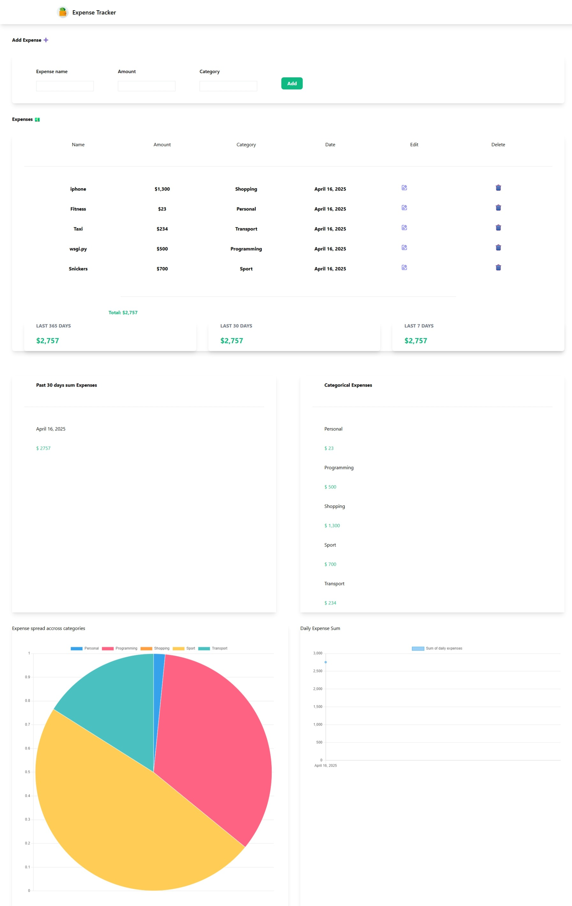

# UdemyProjects
9 projects from the "Django Masterclass" course
(You can see the demo UI for each project in its "screenshots" folder)

In order of appearance:

# 1. Web Based CV Generator opens a form that the user fills with data and returns (directly downloads) a pdf file with the result
- it needs wkhtmltopdf on your device in order the conversion to work (https://github.com/wkhtmltopdf/wkhtmltopdf)

# 2. Web Based Site Scraper that searches for link in format https://www.example.com and returns all valid links
- scraping is done via requests and beautiful soup
- all results are clickable and lead to a new tab with the results
- the "delete" button clears all records from the db
- bootstrap is used for the "design"
- custom form is used for the search bar in order to show appropriate errors in case of ivalid input

# 3. Food Menu App that shows a list of foods and their prices and also which user added the current item
- the models are connected by foreign key or OneToOneField
- the food model has CRUD funtionality
- used pillow to save images as files
- bootstrap for the design
- some class based views are used instead of FBV
- Signals used in order to connect the profile and the user models

# 4. E-Commerce Site that has a paginated list of items which can be added to a cart and the 
information about the order will be stored in the data base.
The cart itself is implemented using the local storage of the browser
- search bar is implemented
- bootstrap 4 is used for the design
- for the main functionality -> JavaScript, AJAX, and jQuery

# 5. Expense Traker (requires Node.js for the Tailwind CSS)

It required the following steps:
- Install node.js (https://nodejs.org/en/download/)
- run npm init -y in the project folder (in my case in the "expense_tracker" folder)
- run npm install tailwindcss (it installed 2.2.19 version)
- add static folder in your custom app (in my case in the "main_app" folder), so the tree would be main_app/static/main_app/
- add src.css to the newly created tree of folders: main_app/static/main_app/src.css
- populate the src.css file with the following three lines: @tailwind base; @tailwind utilities; @tailwind components;
- update the scripts in your package.json file -> "build": "tailwind build main_app/static/main_app/src.css -o main_app/static/main_app/styles.css" 
- run "npm run build" to generate styles.css file in the same folder

Main functionality
- add expenses with name, value and category.
- daily, weekly, monthly and total expenses
- charts for categories and daily expenses (using Chart.js)

6. Chat App
- using channels, uvicorn[standard], js for the websocket connection